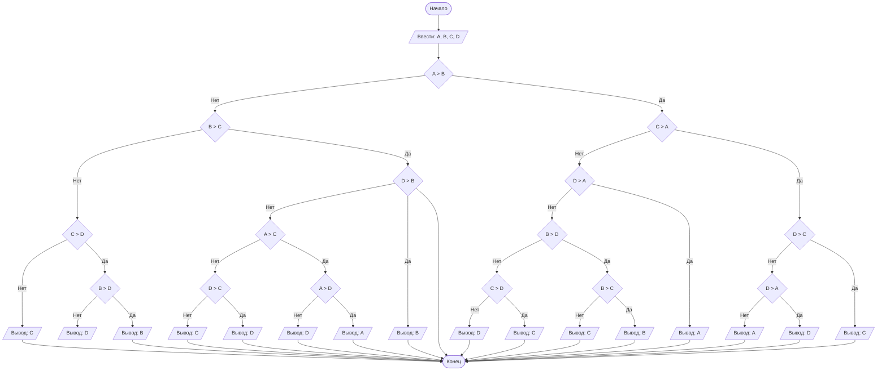

## Отчет по лабораторной работе № 1

#### № группы: ПМ-2501

#### Выполнила: Федотова Анастасия Дмитриевна

#### Вариант: 24

### Cодержание:

- [Постановка задачи](#1-постановка-задачи)
- [Входные и выходные данные](#2-входные-и-выходные-данные)
- [Выбор структуры данных](#3-выбор-структуры-данных)
- [Алгоритм](#4-алгоритм)
- [Программа](#5-программа)
- [Анализ правильности решения](#6-анализ-правильности-решения)

### 1. Постановка задачи

- Условия задачи

> На вход программы подается четыре различных целых числа. Вывести на
экран число, которое меньше одного и больше двух других чисел (то есть,
это число в отсортированной последовательности стояло бы третьим).

- На вход подается четыре числа. Необходимо сравнить их между собой и вывести третье по величине число.

### 2. Входные и выходные данные

Входные данные:

- Тип данных - целое число;
- Программа получает 4 числа;
- Диапазон значений не указан;
Так как диапазон не указан в задаче, зададим его самостоятельно.

|             | Тип         | min значение    | max значение   |
|-------------|-------------|-----------------|----------------|
| A (Число 1) | Целое число | -10<sup>9</sup> | 10<sup>9</sup> |
| B (Число 2) | Целое число | -10<sup>9</sup> | 10<sup>9</sup> |
| C (Число 3) | Целое число | -10<sup>9</sup> | 10<sup>9</sup> |
| D (Число 4) | Целое число | -10<sup>9</sup> | 10<sup>9</sup> |

Выходные данные:

- Тип данных - целое число;
- Программа выводит одно из входных чисел;
- Диапазон значений не указан;
Так как программа выводит одно из 4 чисел, минимальное и максимальное значения не изменяются.

|             | Тип         | min значение    | max значение   |
|-------------|-------------|-----------------|----------------|
| A (Число 1) | Целое число | -10<sup>9</sup> | 10<sup>9</sup> |


### 3. Выбор структуры данных

Программа получает 4 целых числа, не превышающих по модулю 10<sup>9</sup> < 2<sup>31</sup>-1. Поэтому для их хранения
можно выделить 4 переменных (`A`, `B`, `C`, `D`) типа `int`.

|             | название переменной | Тип (в Java) | 
|-------------|---------------------|--------------|
| A (Число 1) | `A`                 | `int`        |
| B (Число 2) | `B`                 | `int`        | 
| C (Число 3) | `C`                 | `int`        |
| D (Число 4) | `D`                 | `int`        | 

Для вывода результата необязательно его хранить в отдельной переменной.

### 4. Алгоритм

#### Алгоритм выполнения программы:

1. **Ввод данных:**  
   Программа считывает четыре целых числа, обозначенные как `A`, `B`, `C` и `D`.

2. **Сравнение чисел:**  
   Программа сравнивает значения `A`, `B`, `C`, `D`. Например, сначала сравниваются `A` и `B`, если `A` больше, то дальше сравниваются `C` и `A` и так далее.
   
3. **Вывод результата:**  
   На экран выводится одно из вводных чисел, которое меньше одного из вводных и больше двух других.

#### Блок-схема



### 5. Программа

```
import java.io.PrintStream;
import java.util.Scanner;

public class Main {
    // Объявляем объект класса Scanner для ввода данных
    public static Scanner in = new Scanner(System.in);
    // Объявляем объект класса PrintStream для вывода данных
    public static PrintStream out = System.out;

    public static void main(String[] args) {
        // Считывание четырех целых чисел A, B, C, D из конссоли
        int A = in.nextInt();
        int B = in.nextInt();
        int C = in.nextInt();
        int D = in.nextInt();

        // Определение третьего по величине числа
        if (A > B)
            if (C > A)
                if (D > C)
                    out.print(C);
                else
                    if (D > A)
                        out.print(D);
                    else
                        out.print(A);
            else
                if (D > A)
                    out.print(A);
                else
                    if (B > D)
                        if (B > C)
                            out.print(B);
                        else
                            out.print(C);
                    else
                        if (C > D)
                            out.print(C);
                        else
                            out.print(D);
        else
            if (B > C)
                if (D > B)
                    out.print(B);
                else
                    if (A > C)
                        if (A > D)
                            out.print(A);
                        else
                            out.print(D);
                    else
                        if (D > C)
                            out.print(D);
                        else
                            out.print(C);
            else
                if (C > D)
                    if (B > D)
                        out.print(B);
                    else
                        out.print(D);
                else
                    out.print(C);
    }
}
```

### 6. Анализ правильности решения

Программа работает корректно на всем множестве решений с учетом ограничений.

1. Тест на положительные числа:

    - **Input**:
        ```
        16 13 20 7 
        ```

    - **Output**:
        ```
        16
        ```

2. Тест на отрицательные числа:

    - **Input**:
        ```
        -2 -7 -11 -5
        ```

    - **Output**:
        ```
        -5
        ```

3. Тест на положительные и отрицательные числа:

    - **Input**:
        ```
        -2 3 7 -10
        ```

    - **Output**:
        ```
        3
        ```
